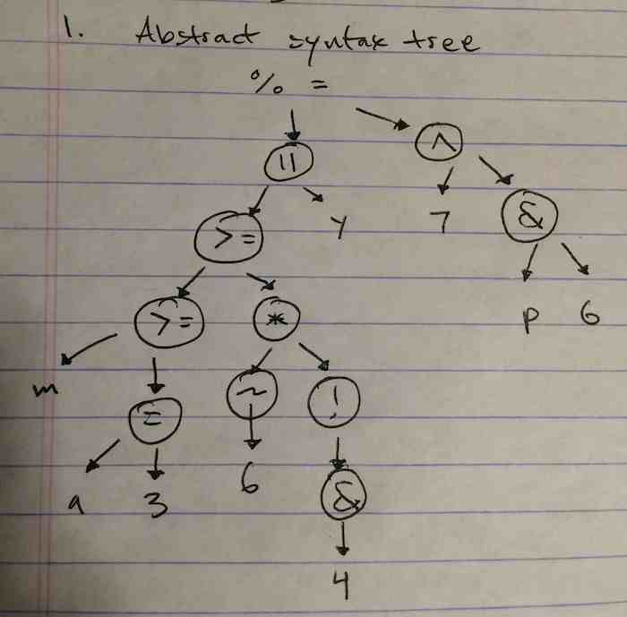

<br><br><br><br>


2a. 
**Expected**: The two separate lines function as a single return statement.
    <BR>**Actual**: The function returns undefined and then never executes the {x: 5} line.
    <BR>In Python the case would: do the same.

2b.
 **Expected**: Initialize b, then a to b+b, then execute (4 + 5).toString(16)
    <BR>**Actual**: Throws TypeError
    <BR>In Python the case would: treat (4 + 5).toString(16) as separate from the initialization of var b.

2c. 
**Expected**: Similar to 2b, absence of semicolon forces program to try to perform the forEach on "mundo"["Hola","Ciao"] which is undefined.
    <BR>**Actual**: Throws TypeError
    <BR>In Python the case would: Correctly evaluate ["Hola", "Ciao"].forEach. Ending the initialization of place at the new line.

2d.  
**Expected**: That the function alerts “Goodbye”, naming the “Hello” function sayHello to be called later.
     <BR>**Actual**: We see “Hello” then “Goodbye”. 
   <BR> In Python the case would: define the sayHello function properly.

<br><br><br>


3a. 
 Parts adapted from http://www.youtube.com/watch?v=hXOC7njMpBE

Function in c program:

```
int f(int i) {
	int a;
	int b = 4;

	if (i <= 0) {
		b = 5;
		return 0;

	} else {
		a = f(-i);
		return a + b;

	}
}
```


<br><br><br>


4a.
** Static scoping **: 1 then, 1 then, 2 then, 2.<br>
second() sets the *global* x var to 2, so last print is 2<br><br>

 **Dynamic scoping**: 1 then, 1 then, 2 then, 1. <br>
second() sets the *local* x var to 2, so last print is 1


<br><br><br>


5a.

Postfix: ```b ~ 4 a x c * sqrt + 2 a x / ```<br>
Prefix: ```/ + ~ b sqrt x x 4 a c x 2 a```

Yes, the expression needs a symbol for unary negation. I used a tilde as per: http://www.techopedia.com/definition/25643/unary-operator-c. The use of x in the expressions (like the problem itself) translates to *  (multiplication), not a variable name.


<br><br><br>


6a.


Python (Assuming we could switch up the evaluation order of the final print here. So, fake Python):

```
# -*- coding: utf-8 -*-
a, b, c, d = 4, 4, 4, 4

def function(x): 
	d = 2
	return 0

print a-function(b)-c*d
```


<br><br><br>


7a. 


```
void* interleave(int a[], int b[], int a_len, int b_len) {

	int result_len;
	int j = 0;
	int* result = malloc((a_len + b_len) * sizeof(int));

	if (a_len > b_len) {
		result_len = a_len;
	} else {
		result_len = b_len;
	}

	for (int i = 0; i < result_len; i++) {
		if (i < a_len) {
			j++;
			result[j] = a[i];
		}

		if (i < b_len) {
			j++;
			result[j] = b[i];
		}
	}
	return result;
}
```


<br><br><br>


8a.


```
template<class T>

vector<T> interleave(vector<T> a, vector<T> b) {

	vector<T> result = {};

	int a_len = a.size();
	int b_len = b.size();
	int result_len = max(a_len, b_len);

	for (int i = 0; i < result_len; i++) {
		if (i < a_len) {
			result.push_back(a[i]);
		}

		if (i < b_len) {
			result.push_back(b[i]);
		}
	}
	return result;
}
```


<br><br><br>


9a. 
Not efficient


<br><br><br>


10a. 

The if the general type indicator T indicates that arguments y and z are functions, C eagerly evaluates both functions as the main function is called. A macro would allow the functions to be more lazily evaluated, expanding the macro-ed code into the source. Instead of evaluating y and z off of the bat, y or z would be evaluated upon the programs entry into their specific sections in the conditional statement.

```#define IF_THEN_ELSE(x, y, z) ((x) ? (y) : (z))```


